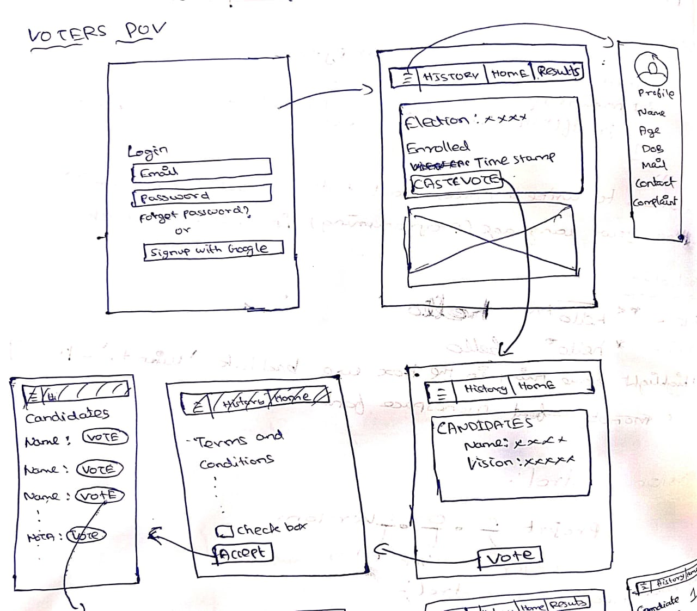
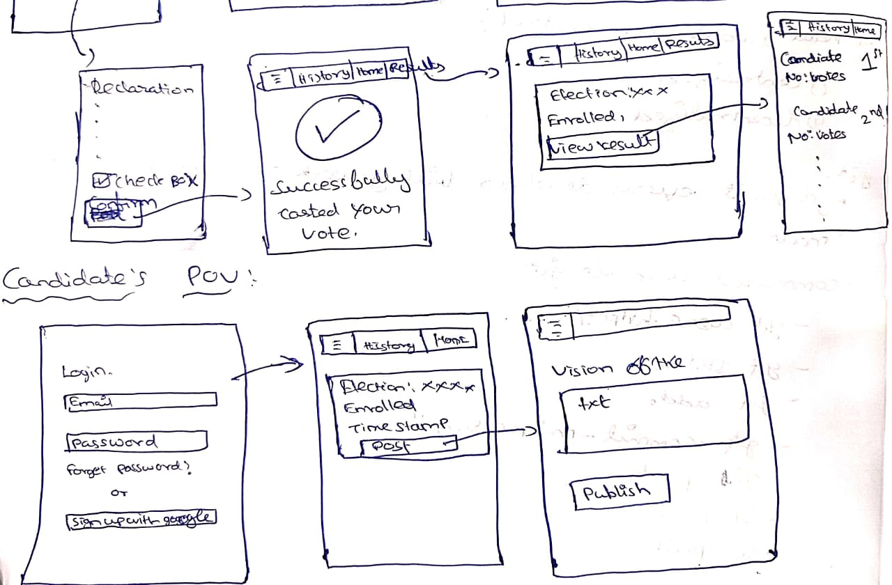
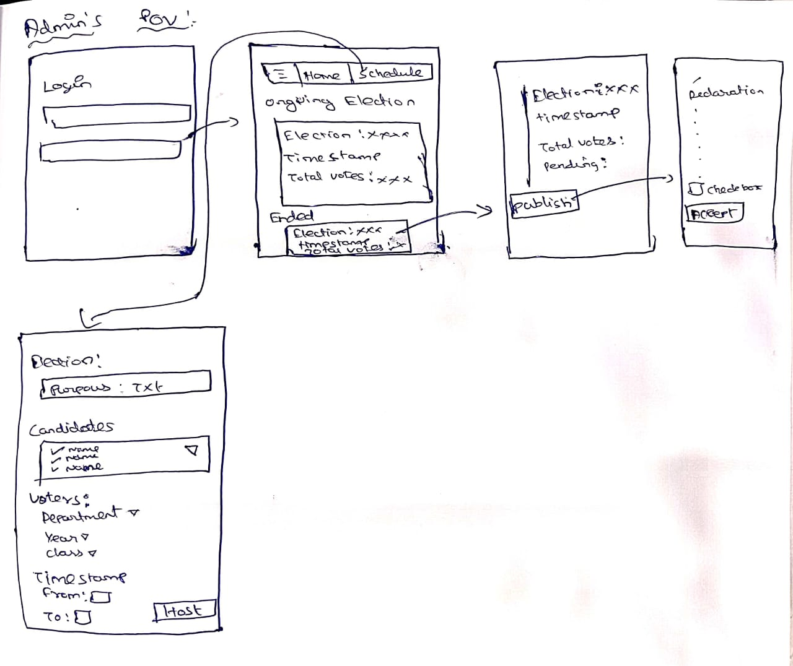

# Online-Election-App

This app enable the Voters to vote for the correct Candidate

## Objective

  The Elections are conducted through online mode where the `Candidates` can post their propaganda
  `Voters` shoud vote for them and there will be `Admin` who host the election (Inside the college)

## Project workflow

### **Admin**

1. The one who host the election

2. They have the rights to Outline the election he will choose the Candidates and Creat the ajanda of the Election

3. they post the results after the election

### **Candidate**
  
1. They have the profiles where they post the activities that they have done before

2. There will be Dashboard which showcase the Elections which are enrolled

### **Voters**

1. They are voting for the election

2. They can see the candidate profile, activities and propagandas

3. They are login using their College mail id so that Valid voters only poll for the election

## Teck Stack

1. `Mongo DB` for storing the Candidate, Voters, and Admin details

2. `Express` and `Node.js` for Backend

3. `React.js` for Frontend

## Future updates

1. Social media like Pages where the activities of the candidates are posted where the voters can like and comment  

## Layout Images

